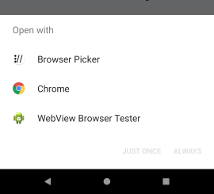
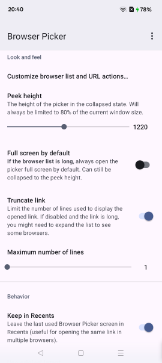

# Android Browser Picker

## Why this project

Some years ago it was possible to avoid setting a default browser on Android. This allowed to see this simple picker when opening links from different apps:

However, in the recent Android versions this was disabled, and now we are forced to set one of the browsers as default. Quite a questionable decision, because users might want to use multiple different browsers, not just the one bundled with Android. Definitely when we're talking about different types of links.

Think of a link you receive in a not completely trustworthy looking SMS - would you want to open it using the same browser where you have all your credentials and autofill data stored? Or opening a link to some tabloid website sent to you by a friend? These kind of websites are usually full of advertisements, annoying popups and requests to enable notifications. For such stuff there are nice private browsers available on Play Store, like Firefox Focus.

So, because of this need for choice this application was born. At first as a very simple picker, but with the version 2.0 it is pretty much completely reborn and turned into a comprehensive application which is still small and efficient, but provides maximum flexibility allowing to customize and tweak pretty much all its functionality.

## Features

- Can be used 2 modes:
  - as the default browser: will handle the incoming links and display the picker with the list of browsers and actions that can open it.
  - as a share target. Same principle, but the app is also able to detect links in the text and doesn't require the app being set as default browser.
- Extensive customization capabilities:
  - Reordering/hiding displayed browsers. Reordering is also possible via the attached keyboard.
  - Custom actions (Copy link, Share link)
  - Ability to detect and hide non-browser applications (for instance, Play Store when opening the links to Play Store)
  - Other tweaks, like bottom sheet peek height, number of lines to display the link etc.
- Modern, edge-to-edge design according to [Material 3 guidelines](https://m3.material.io/).
- Dark mode support.
- Extremely lightweight! The APK is less than 2 MB and the size on device is less than 4 MB.
