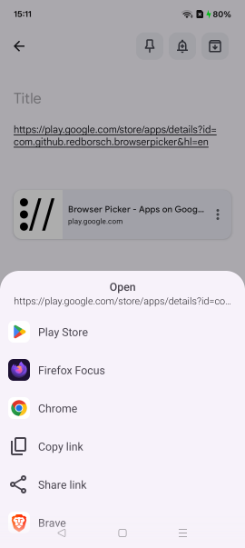
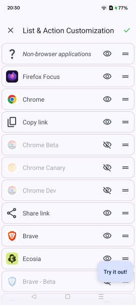

Browser Picker is a simple application bringing back to Android the ability to choose a browser when opening links.

Benefits:
- No ads
- Extremely lightweight (less than 2 MB download and less than 4 MB on the device)
- Extensive customization & tweaking capabilities
- [Open source](https://github.com/redborsch/android-browser-picker)
- Dark mode support
- Support for the latest Android versions, edge-to-edge, Material 3 design

### Troubleshooting

[Browser Picker doesn't show the browser menu when clicking on some links](troubleshooting/verified-links.md)
